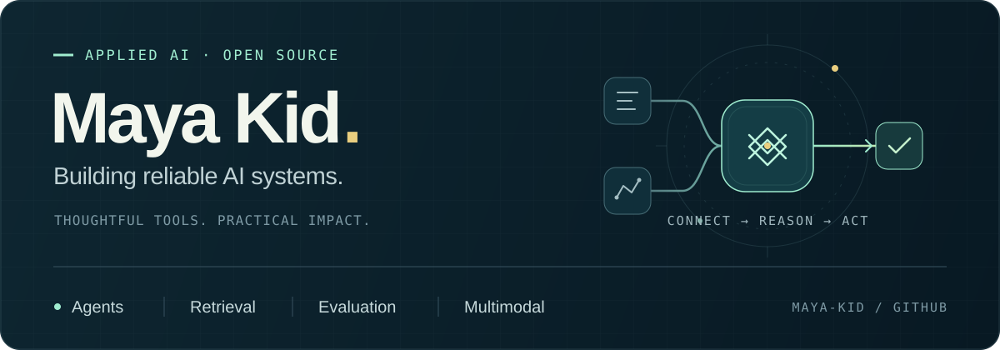

### Hi, I'm Maya Kid 👋

**Applied AI · Agent Engineering · Retrieval & Knowledge Graphs · Multimodal Systems**

I work on the details that make AI dependable — from evidence-grounded answers to resilient agents and reliable data pipelines.

  
  

105 merged PRs to Utopia as of October 7, 2026 · <a href="https://github.com/deeplethe/utopia/pulls?q=is%3Apr+author%3AMaya-Kid+is%3Amerged">Explore the contributions ↗</a>

---

## 🧭 About Me

I'm a developer with a **background in mathematics**, working at the intersection of AI agents, information retrieval, and real-world interaction. I enjoy taking a useful idea through the engineering needed to make it dependable: clear permissions, traceable evidence, reproducible evaluation, and human oversight.

- 🔭 **Open-source focus:** contributing to [Utopia](https://github.com/deeplethe/utopia), an open-source enterprise world model, with work across retrieval, graph reasoning, agent conversations, and data connectors.
- 🔎 **Retrieval & evaluation:** hybrid lexical and semantic search, two-stage ranking, held-out evaluation, and preventing data leakage.
- 🤖 **Agents & tooling:** MCP, structured outputs, tool calling, permission-aware execution, and human approval flows.
- 🦾 **Beyond the screen:** multimodal sensing, depth cameras, IMUs, voice interaction, and connecting model suggestions to controlled hardware execution.

## 🛠️ Tech Stack & Tools

  
  
  
  
  
  
  
  
  

**Systems** · RAG · Knowledge graphs · Tool calling · Human-in-the-loop  
**Evaluation** · Recall@K · NDCG · Precision · Latency · Ablation studies

---

## ✅ Selected Open-Source Contributions

**[Utopia](https://github.com/deeplethe/utopia) · Contributor**  
Selected merged PRs, with the engineering problem behind each change.

| Contribution | What changed |
| :--- | :--- |
| **Evidence-grounded answers** | Linked graph answers to source facts so readers can inspect the evidence. [#968](https://github.com/deeplethe/utopia/pull/968) |
| **Resilient agents** | Added history budgeting and context-overflow recovery for long conversations. [#973](https://github.com/deeplethe/utopia/pull/973) |
| **Retrieval correctness** | Stabilized tied search results and fixed filtering order that could drop valid matches. [#1060](https://github.com/deeplethe/utopia/pull/1060) · [#728](https://github.com/deeplethe/utopia/pull/728) |
| **Efficient embeddings** | Reused each turn's question embedding across mapping selection, retrieval, and graph tools. [#978](https://github.com/deeplethe/utopia/pull/978) |
| **Temporal reasoning** | Completed transitive inference chains when a missing premise arrives later. [#1051](https://github.com/deeplethe/utopia/pull/1051) |
| **Data integrity** | Corrected Databricks and Snowflake partition reads; preserved comments in incremental GitHub sync. [#1063](https://github.com/deeplethe/utopia/pull/1063) · [#1062](https://github.com/deeplethe/utopia/pull/1062) · [#1061](https://github.com/deeplethe/utopia/pull/1061) |

<a href="https://github.com/deeplethe/utopia/pulls?q=is%3Apr+author%3AMaya-Kid+is%3Amerged"><strong>View all merged contributions →</strong></a>

## 🔬 Broader Engineering Work

Alongside open source, my work spans enterprise knowledge workflows, candidate retrieval and ranking, and multimodal sensing.

| Area | Engineering focus |
| :--- | :--- |
| **Agent workflows** | Structured tools, explicit permissions, approval flows, traceable execution, and idempotent writes. |
| **Retrieval & ranking** | Hybrid candidate retrieval, two-stage ranking, and held-out evaluation with attention to leakage. |
| **Multimodal robotics** | Depth and inertial sensing, voice interaction, and clear boundaries between model suggestions and hardware actions. |
| **Applied ML experiments** | Low-cost spectral sensing, sample-level validation, matched ablations, and end-to-end demos. |

Private work is described at a technical level; client identities, private datasets, and internal implementation details are omitted.

---

## 🤝 Let's Build

I'm interested in collaborating on **reliable agent tooling, retrieval and evaluation, knowledge systems, and multimodal applications**.

If you're working on something in these areas, I'd be glad to compare notes, review an idea, or contribute a fix.

  
  

  Curious about the model. Careful about the system.

